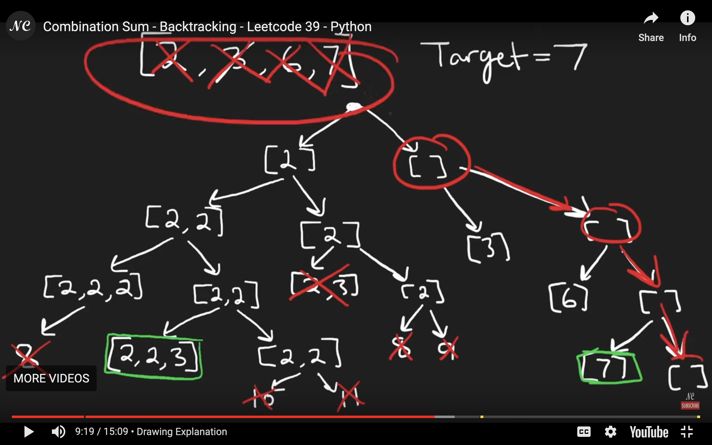
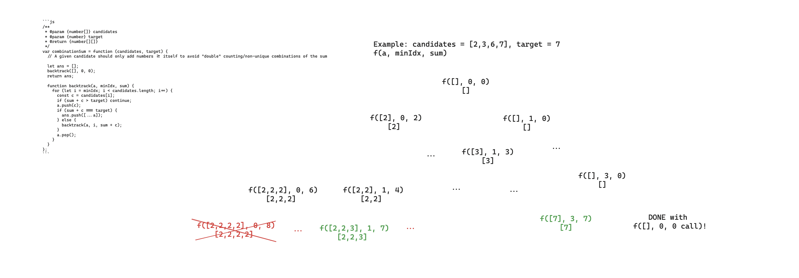

# 39. Combination Sum

## Link

https://leetcode.com/problems/combination-sum/description/

## Prompt

> Given an array of distinct integers candidates and a target integer target, return a list of all unique combinations of candidates where the chosen numbers sum to target. You may return the combinations in any order.
>
> The same number may be chosen from candidates an unlimited number of times. Two combinations are unique if the frequency of at least one of the chosen numbers is different.
>
> The test cases are generated such that the number of unique combinations that sum up to target is less than 150 combinations for the given input.

## Intuition

We want to generate all valid combinations of a sum using specific summands (where we can repeat a specific one many times). We'd like to start from an empty sum, and then try to add whatever elements are possible and see whether they add to the target value, but only use unique sums (i.e. combinations instead of permutations).

We're essentially making many decisions at different points (i.e. we navigate a decision tree), choosing when to visit a path, when to stop visiting the current path, and when the current path is "good" to add to the result.

_Note: it isn't entirely clear to me yet why DP solution submissions seem to be slower. From ChatGPT:_

> In the case of the combination sum problem, backtracking is a natural fit because you are exploring different combinations, and there's no need to store and reuse intermediate results. The goal is to find all valid combinations, and backtracking is well-suited for this exploration.
>
> While backtracking can have an exponential worst-case time complexity, the pruning conditions and the nature of the problem may allow the algorithm to perform well in practice. In some cases, backtracking solutions can outperform DP solutions, especially if the problem doesn't exhibit a clear overlapping substructure that DP can take advantage of.
>
> If the fastest solutions on the submissions page are using backtracking for this specific problem, it suggests that backtracking might be well-suited for the problem and may perform better than a DP solution in practice. The complexities provided earlier are theoretical worst-case scenarios, and the actual performance can be influenced by the specific characteristics of the input data.

## Approach

We need to be able to:

1. have our initial state/how we start to navigate the decision tree
2. know when to stop going down a branch
3. know when a given node along a branch is good, and add the combination to the result
4. confirm that how we're building/traversing the tree avoids counting an unique combination multiple times

Our answer is initially empty and as we traverse the decision tree we'll populate it.
At a given point, we'll:

1. look at the current combination's elements and it's sum
2. determine all possible valid elements to add to this sum
3. for each valid element:

- if taking it would go over the target sum, don't take it/skip it and don't consider it's sub-branches (guaranteed to be larger as well because of positive summands)
- if taking it would match the target sum exactly, take it and update the answer, without considering it's sub-branches (guaranteed to be larger as well because of positive summands)
- if taking it would fall short of the target sum, explore the branch after "taking it"

The unique representation is achieved by creating/navigating the decision tree in a way that, at each possible summand, we consider only itself and summands to the right (i.e. we don't repeat answers across sub-branches).

### Visualizations

#### Neetcode



#### Mine



## Complexity

### Time

_Note: these are still somewhat unclear and could use some clean up._

> `O(N^M)`, where `N` is the number of candidates, and `M` is the maximum recursion depth.

- In the worst case, we explore all combinations

_Note: it's not exactly this because of the pruning, improve it once I know how._

### Space

> `O(min(N, target))`, where `N` is the number of candidates.

- In the worst case, the current combination can have at most `min(N,target)` elements (all 1s, any summands > target will be effectively useless and just do O(1) checks, never being explored further)
- In the worst case, the max recursion depth would be at most `min(N,target)` for the same reason as above

## Code

```js
/**
 * @param {number[]} candidates
 * @param {number} target
 * @return {number[][]}
 */
var combinationSum = function (candidates, target) {
  // A given candidate should only add numbers >= itself to avoid "double" counting/non-unique combinations of the sum

  let ans = [];
  backtrack([], 0, 0);
  return ans;

  function backtrack(a, minIdx, sum) {
    for (let i = minIdx; i < candidates.length; i++) {
      const c = candidates[i];
      if (sum + c > target) continue;
      a.push(c);
      if (sum + c === target) {
        ans.push([...a]);
      } else {
        backtrack(a, i, sum + c);
      }
      a.pop();
    }
  }
};
```
